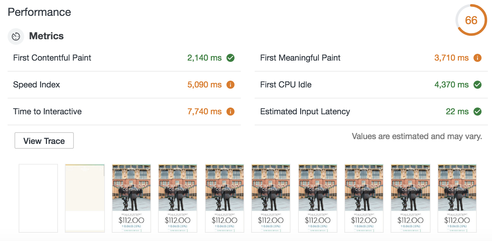
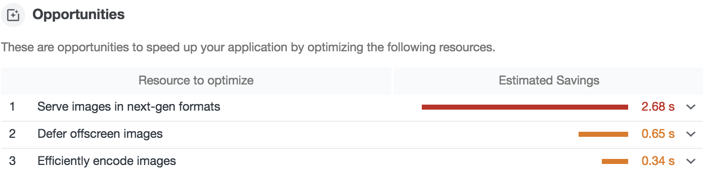
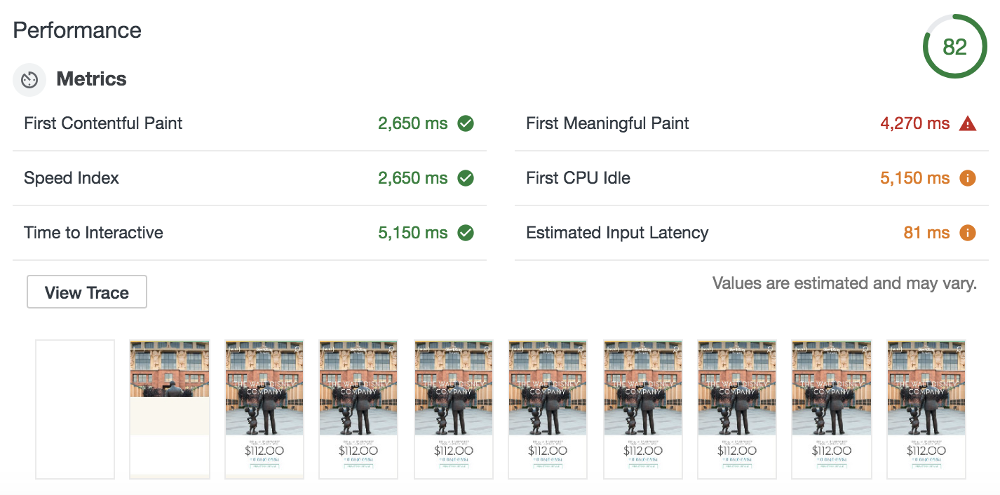
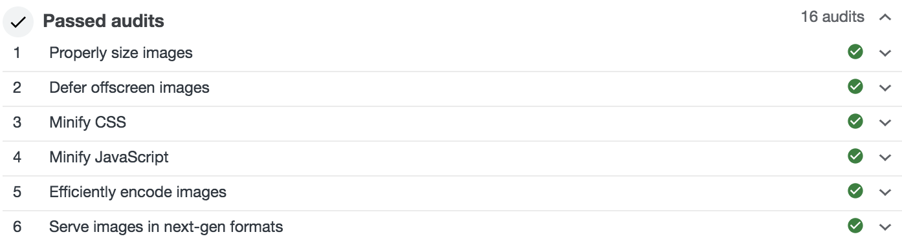

# WordPress Image Optimizer

This Fly App speeds up any WordPress site by optimizing images, which dramatically improves Lighthouse scores.

## Lighthouse

Google Lighthouse measures user perceived application performance, and assigns a score of 0-100 (100 is good, 0 is gross).

### Before optimizations

### With optimizations

## What it does

This app primarily optimizes images:

1. Converts and serves all images in WebP format when browsers send an `Accept: image/webp` header
2. Lazy-loads offscreen and hidden images

## Try it yourself

1. First, make sure you have the latest version of Fly installed by running `npm i -g @fly/fly`
2. `git clone https://github.com/superfly/wordpress-image-optimizer.git`
3. `cd wordpress-image-optimizer`
4. `fly server`
5. Visit http://localhost:3000 to view the app

You should see an example WordPress site (https://www.thewaltdisneycompany.com/)

6. Navigate to the `index.js` file and change `const origin` (line#6), `const assets` (line#7), and `const rewrites` (line#22) to match your own domain
7. Save and visit localhost again

You should now see your own WordPress site with properly sized, lazy-loading, WebP images! Run a Lighthouse audit and see for yourself just how well your site is performing .. and then, deploy!

8. Run `fly login` (make sure you have a Fly account first, if you don’t, register at https://fly.io/app/sign-up)
9. Run `fly apps create <app-name>` to create a Fly Edge App
10. Then run `fly deploy` to deploy your Fly Edge App